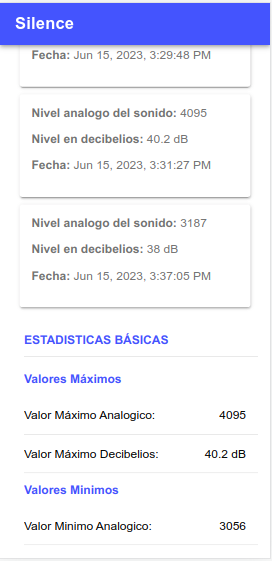

# Aplicación Móvil Desarrollada Con Ionic, Angular y Firebase (Realtime Database)

Aplicación móvil android desarrollada con el fin de controlar un dispositivo de alarma de forma remota. Aplicando IoT (Internet de las cosas), se ha creado un dispositivo de alarma mediante arduino R3 y el modulo wifi ESP32, el cual es implemntado para el control de ruido en bibliotecas.

* **Funciones del dispositivo:**
Su funcionamiento esta basado en la detección de ruido mediante el sensor de sonido KY-038, al cual se le establece un umbral mediante la App móvil, este umbral al ser sobrepasado la alarma emite un sonido no intrusivo para alertar a los presentes que deben hacer silencio, puesto que, pueden perturba la tranquilidad de los presentes.
La alarma al ser activada registra en firebase la fecha, hora y el nivel analogico del sonido que la activó, de esta manera se crea un historial de la cantidad de veces que se a activado.

* **Funciones de la App:**
La App permite apagar y encender el dispositivo, así como establecer el umbral de sonido máximo permitido, también muestra el historial registrado de la cantidad de veces diarias que se ha activado la alarma, es decir, que permite filtrar el historial por la fecha seleccionada. Además, muestra estadisticas básicas como: el nivel máximos de sonido diario, minimos, rangos y medias. Los valores mostrados estan dados en su nivel analogico y decibelios (dB).

## Imágenes de la App

    
    
    

