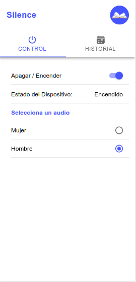
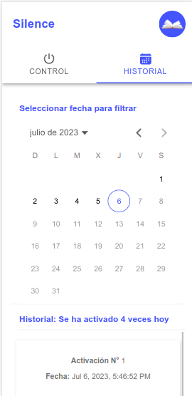

# Aplicación Móvil Desarrollada Con [Ionic](https://ionicframework.com/docs), [Angular](https://angular.io/docs) y [Firebase](https://firebase.google.com/?hl=es) (Realtime Database)

Se ha desarrollado una aplicación móvil para dispositivos Android con el propósito de permitir el control remoto de un sistema de alarma. Utilizando la tecnología de IoT (Internet de las cosas), se ha creado un dispositivo de alarma utilizando Arduino Uno R3 y el módulo Wifi ESP32. Este dispositivo se ha diseñado específicamente para controlar el nivel de ruido en bibliotecas.

* **Funciones del dispositivo:**
El funcionamiento de esta aplicación se basa en la detección de ruido a través de un sensor de sonido KY-038. De manera digital se puede ajustar la sensibilidad del sensor y cuando este tiene una sensibilidad debil o capta niveles de ruido muy excesivos, se activa una alarma que emite un sonido discreto para alertar a las personas presentes, recordándoles que deben mantener silencio para no perturbar la tranquilidad del entorno. Además, cuando se activa la alarma, se registran automáticamente la fecha y hora en Firebase. De esta manera, se crea un historial que muestra cuántas veces se ha activado la alarma.

* **Funciones de la App:**
La aplicación ofrece varias funcionalidades, como la capacidad de encender y apagar el dispositivo, así como establecer el audio que se desea que suene en la alerta del dispositivo. Además, muestra un historial que registra la cantidad de veces que se ha activado la alarma en un día determinado, lo que permite filtrar el historial por fecha seleccionada.

## Imágenes de la App

<div align="center" style="display grid; grid-template-column: repeat(1fr, 2);">
    
    
</div>

## ¿Qué hacer después de clonar o descargar el proyecto?

* #### Acceder al directorio del proyecto

    ```bash
    cd app-pas
    ```
* #### Instalar las dependencias

    ```bash
    npm install
    ```
    
* #### Establecer variables de entorno
    * Debe establecer las variables de entorno en el directorio **environments** ubicación: **src/environments/environment.prod.ts también src/enviroments/environment.ts**, **environment.prod.ts** son las varibales de producción y **environment.ts** las de desarrollo, debe proporcionar el **firebaseConfig** en ambos. Tenga en cuenta que en las varibles de desarrollo **environment.ts** la propiedad **production** debe estar en **false**, es decir, **production: false**.

    ```typescript
    export const environment = {
        production: true,
        firebaseConfig: {
            apiKey: 'myApiKey',
            authDomain: 'myAuthDomain',
            databaseURL: 'mydatabaseURL',
            projectId: 'myProjectId',
            storageBucket: 'myStorageBucket',
            messagingSenderId: 'myMessagingSenderId',
            appId: 'myAppId',
            measurementId: 'myMeasurementId'
        }
    };
    ```
    
* #### Ejecutar la Aplicación

    ```bash
    ionic serve
    ```
## Generar la Aplicación Android

Para generar la aplicación se usa capacitor que es una herramieta que permite convertir una aplicación web en una aplicación móvil android o ios, en este caso nos enfocamos en android, realice lo siguiente para generar la app.

```bash
ionic cap add android
```
con esto se genera la carpeta android, luego se debe crear el build del proyecto, para ello realice.

```bash
ionic cap sync
```
Luego se debe ejecutar la app, tenga en cuenta que debe tener Android Studio instalado en su computadora, puesto que, capacitor usa el IDE ofical de la plataforma para compilar la app, para ello realice.

```bash
ionic cap open android
```
Con esto se abrira Android Studio y podrá compilar la aplicación y generar el apk correspondiente.
